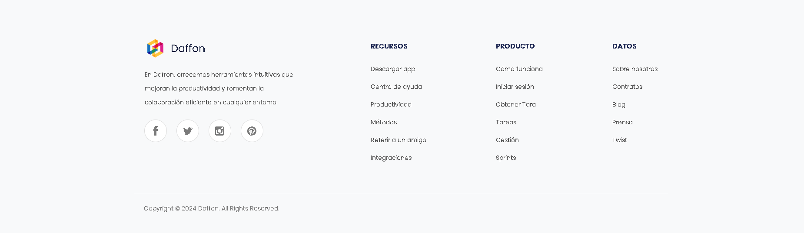

# Daffon - Web de Videollamadas

Daffon es un proyecto web con temática de aplicación de videollamadas, asignado por la empresa **DIGITAL BUHO S.A.C** y supervisado por el gerente **Enrique Baca Deyvis Daniel** para el equipo de diseñadores front-end.

## 🚀 Objetivo del Proyecto
Desarrollar una interfaz basada en un **mockup aleatorio** seleccionado individualmente por cada diseñador. En este caso, se ha elegido el diseño de **Daffon**. Se ha mantenido una alta fidelidad al mockup original (90%), con mejoras en la organización, optimización del código y la adición de nuevas funcionalidades.

## 🌟 Mejoras Implementadas
- **Cambio de idioma**: Opción para alternar entre **Español** e **Inglés** a través de botones en el header, permitiendo cambiar de un `index` a otro en su idioma.
- **Animaciones de entrada**: Gestionadas con **AOS.js** directamente en el mismo `index.html`.
- **Reestructuración del código**: Más corto y optimizado.
- **Estilo visual mejorado**: Manteniendo el 90% del diseño original.
- **Compatibilidad con dispositivos móviles (Responsive Design)**: Aún no implementada, pero planificada para el futuro.

## 🛠️ Tecnologías Utilizadas
- **HTML5**
- **CSS3 (Flexbox y Grid)**
- **JavaScript**
- **AOS.js** (Para animaciones)

## 🎨 Referencia Visual
[Descargar Mockup](https://www.mediafire.com/file/4qenv7bumluop8q/30f66805bddec434c910bfc674fb255e.png/file)

## 📸 Avance Visual del Proyecto

### Header e Inicio 🏠


### Funcionalidades 📖


### ¿Por qué Elegirnos? 📚


### Colaboración 📊


### Productividad 📈


### Comentarios 💬


### Noticias 📢


### Footer 📑


---

## 🔧 Funcionalidades Adicionales
- **Cambio de idioma en tiempo real a través de botones en el header**.
- **Efectos de animación al hacer scroll con AOS.js**.
- **Optimización de la estructura del código para mejorar rendimiento**.
- **Compatibilidad con dispositivos móviles (en desarrollo futuro)**.

## 📂 Estructura del Proyecto
```
Daffon/
│
├── index.html
├── ingles.html
├── css/
├── img/
└── readme.md
```

## 📝 Instrucciones de Uso
1. Clonar el repositorio.
2. Abrir `index.html` o `ingles.html` en el navegador.
3. Cambiar de idioma desde el botón ubicado en la esquina superior derecha.
4. Disfrutar de la experiencia visual y las animaciones.

## 🎯 Conclusión
Daffon ha sido optimizado para una experiencia fluida, visualmente atractiva y con una interfaz multilingüe. Cualquier actualización futura deberá alinearse con los lineamientos del diseño original.