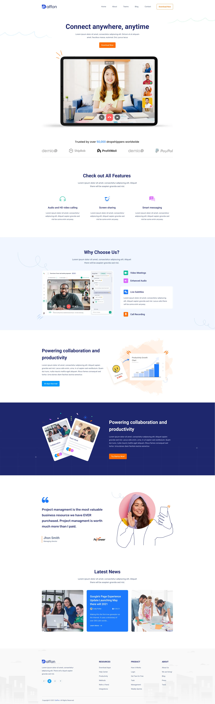
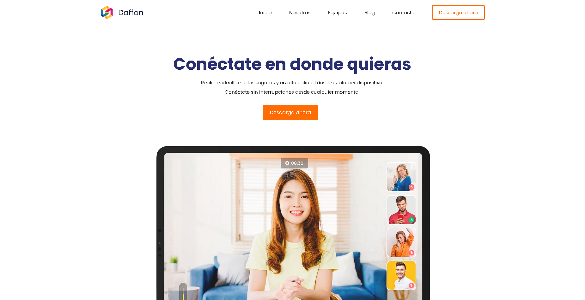
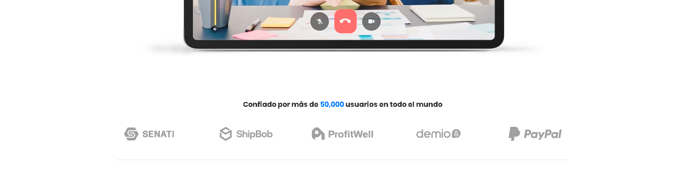
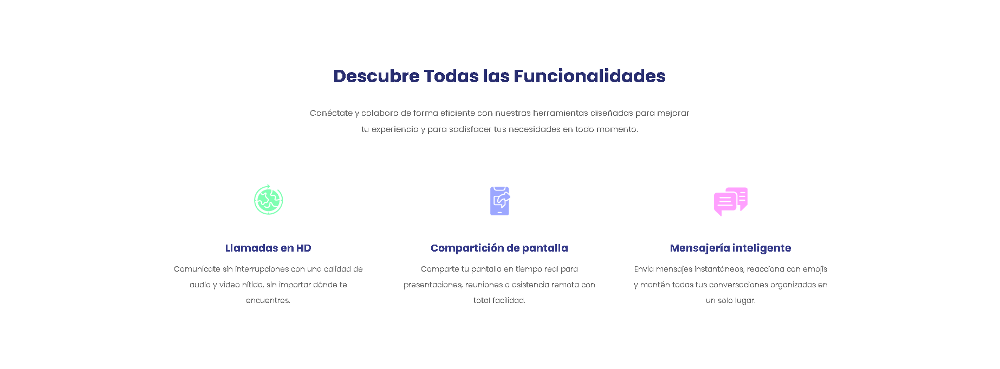
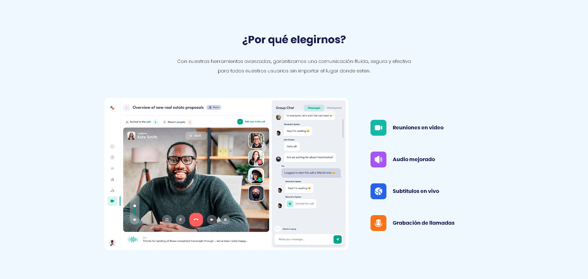
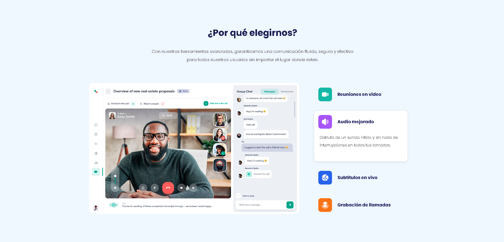
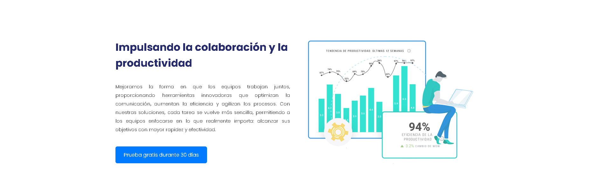
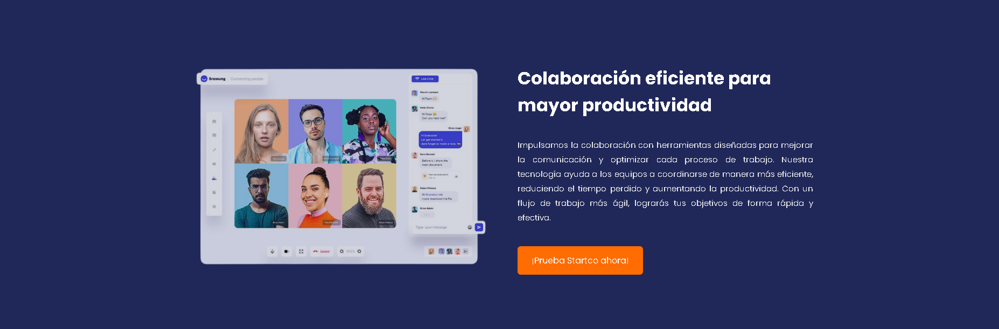
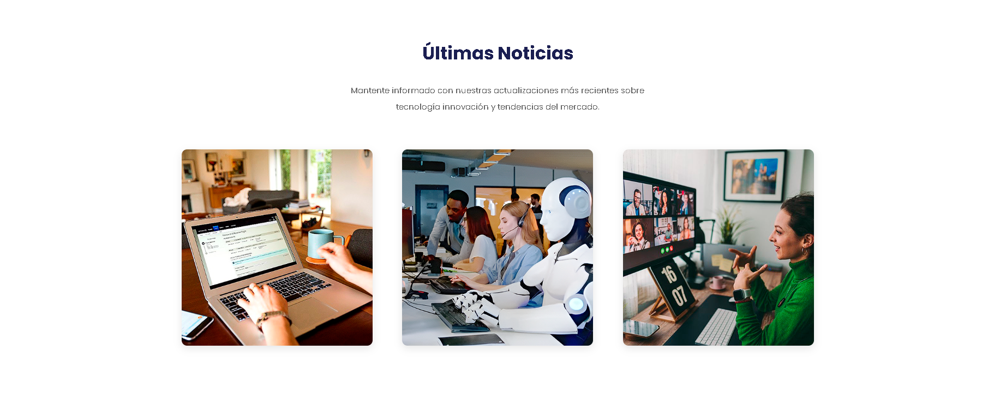
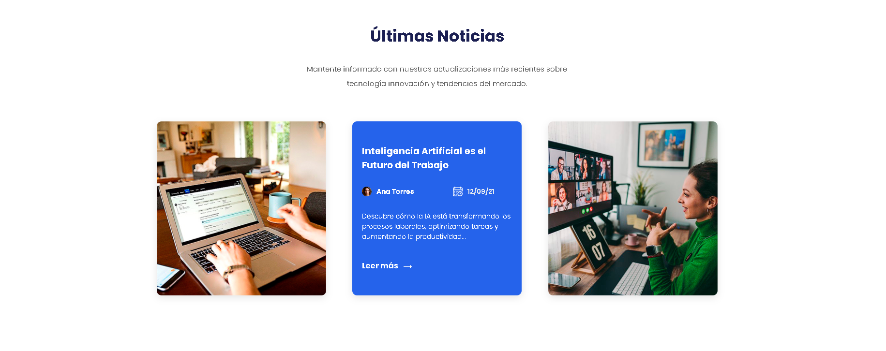

# Daffon - Web de Videollamadas

Daffon es un proyecto web con temática de aplicación de videollamadas. Esta tarea ha sido asignada por la empresa **DIGITAL BUHO S.A.C** y encargada por el gerente **Enrique Baca Deyvis Daniel** para el grupo de diseñadores front-end. 

## 🚀 Objetivo del Proyecto
El propósito de este proyecto es desarrollar una interfaz basada en un **mockup aleatorio** descargado por la empresa, el cual fue seleccionado por cada diseñador de manera individual. En este caso, se ha elegido el diseño de **Daffon**. Se espera que los practicantes copien o tomen inspiración del mockup sin realizar demasiados cambios en el diseño.

## 🛠️ Tecnologías Utilizadas
Los lenguajes y estructuras a utilizar quedan a elección de cada diseñador.

## 🎨 Referencia Visual
A continuación, se deja una imagen de referencia del mockup utilizado:

---

## 🎨 Avance Visual del Proyecto:

### Seccion del Header y Inicio

---

### Seccion de las Funcionalidades

---

### Seccion Por que Elegirnos?

---

### Seccion de Colaboracion

---

### Seccion de Productividad

---

### Seccion de Comentario

---

### Seccion de Noticias

---

Cualquier actualización o mejora del proyecto deberá alinearse con los lineamientos del diseño original.